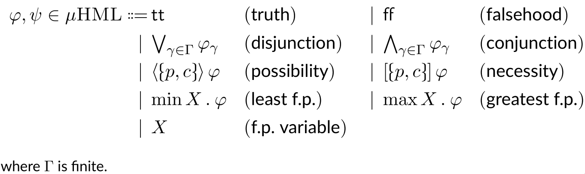
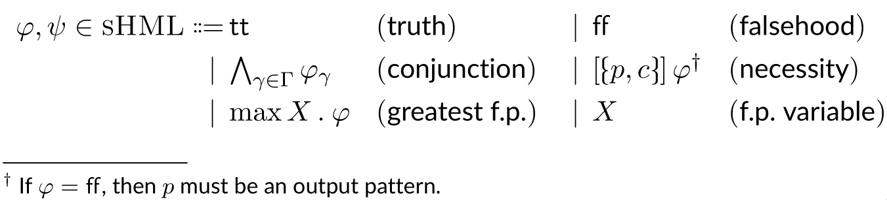
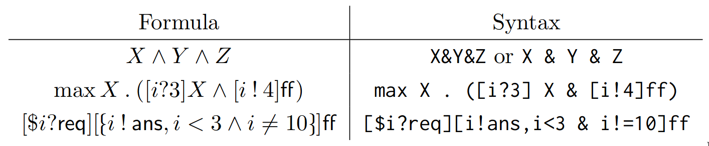

# sHML Parser and Normaliser

This project is part of my [undergraduate dissertiation in computer science](https://luke.collins.mt/cs-apt.pdf). 

## What is sHML?

[Runtime enforcement](https://en.wikipedia.org/wiki/Runtime_verification) is the process of analysing the behaviour of software systems at runtime, and _enforcing_ ''correct'' behaviour using software entities called **monitors**.  A monitor wraps itself around the system and analyses all its external interactions. This allows it to transform any incorrect actions by replacing them, suppressing them, or inserting other actions.    

It is rarely feasible to build _ad hoc_ monitors from scratch. Instead, the correctness specification of a system is expressed as a formula in some **logic** with precise formal semantics, and a program designed to interpret this logic synthesises the monitor automatically.
        
One such logic is the [Hennessey–Milner logic](https://en.wikipedia.org/wiki/Hennessy%E2%80%93Milner_logic) with recursion (*μHML*).

  

### Example: A server
Suppose a server is identified by process id _i_. Whenever the server receives a request (_i_ ? req)  it outputs an answer (_i_ ! ans), unless it receives a special request for closure (_i_ ? cls). The server's behaviour may be expressed by the [CCS](https://en.wikipedia.org/wiki/Calculus_of_communicating_systems) equation 

> _p_ = _i_ ? req  ·  i ! ans + i ? cls · ∅.

        
A possible correctness specification for this system in *μHML* is the safety property 

> _φ_ = max _X_ . \[_i_ ? req\]\[_i_ ! ans\](_X_ ∧ [_i_ ! ans]ff)

which ensures that a request (_i_ ? req), followed an answer (_i_ ! ans), is then followed by a request (_i_ ? req), and never another answer (_i_ ! ans), i.e., only one answer is sent following a request.

### sHML and Normal Form
 Not all formulae in *μHML* are enforceable, i.e., they do not all correspond to ''valid'' monitors. The **safety fragment**, so-called sHML, is a subset which _is_ enforceable.  

  

Now, in [Aceto et. al](https://arxiv.org/abs/1804.08917), a synthesis function for monitors corresponding to sHML formulae in **normal form** is given.  Normal form is yet another restriction of *μHML*, i.e., *sHML*nf⊆*sHML*⊆*μHML*, however this restriction is only superficial,  in that every *sHML* formula can be reformulated into an equivalent one in normal form: *sHML*nf=*sHML*⊆*μHML*.

An *sHML* formula _φ_ is in normal form if the following hold.

 1. Branches in a conjunction are pairwise disjoint, i.e., in [*a*]*ϑ*∧[*b*]*ϕ*, we have *a*∩*b*=∅,
 2. For every max _X_ . _ϕ_, we have *X*∈fv(_ϕ_),
 3. Every logical variable is guarded by modal necessity, i.e., no variable _X_ appears without [*a*]*X*.

## Syntax and Usage
The code parses a given *sHML* formulae and translates it into an equivalent formula in normal form. The theory behind the development of this algorithm is explained in detail [here](https://drmenguin.com/files/cs-apt.pdf). 

Below are some examples of the parser's syntax.

  

### Installation
To use the software, download a Haskell parser such as [ghc](https://www.haskell.org/ghc/), and clone this repository. In a terminal, navigate to the repository directory and run

    ghci
    
to launch the interactive Haskell REPL. Then do

    :load SHMLNormaliser.hs
    
and you should see something like the following.

    Prelude> :load SHMLNormaliser.hs
    [1 of 2] Compiling SHMLParser       ( SHMLParser.hs, interpreted )
    [2 of 2] Compiling SHMLNormaliser   ( SHMLNormaliser.hs, interpreted ) 
    Ok, two modules loaded.
    *SHMLNormaliser>

### Commands
#### parseF
You can parse a formula using the `parseF` command, e.g.
     
    phi = parseF "[i?3]max X.(X & [i!4]Y)"

will produce the output 

    [i ? 3](max X . (X ∧ [i ! 4]Y))

#### parseTree

The `parseTree` command shows how a formula is parsed. Running

    parseTree phi
    
where `phi` is the formula defined above, produces the output

    Necessity
    └─ Input
     └─ i (free variable)
     └─ 3 (int const)
    └─ True (bool const)
    └─ max X .
     └─ ∧
        └─ X (logical variable)
        └─ Necessity
           └─ Output
              └─ i (free variable)
              └─ 4 (int const)
           └─ True (bool const)
           └─ Y (logical variable)

### nf
Given a formula, `nf` will return an equivalent formula in normal form. Doing

    nf phi

where `phi` is the formula defined above, produces the output

    [i ? 3]([i ! 4]Y)
    
which is equivalent to `phi` but is in normal form.

